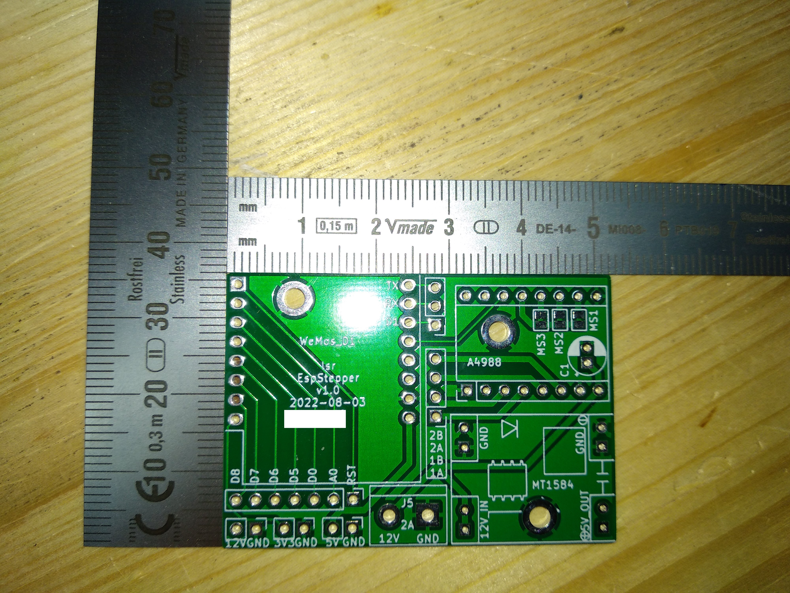

# EspStepper

control a [NEMA stepper motor](https://en.wikipedia.org/wiki/Stepper_motor#NEMA_stepper_motors) with [Home Assistant](https://www.home-assistant.io/) using a D1 mini via [ESPHome](https://esphome.io/). 

## Executive Summary
* This project provides a solution for controlling a NEMA stepper motor with Home Assistant (via ESPHome), utilizing a D1 mini board.
* This project consists of a KiCad project that gives you the [Gerber files](gerber/gerber.zip) to order a PCB (e.g. at [JLCPCB](https://cart.jlcpcb.com) onto which (mostly) passive components (pinheaders/sockets) are soldered. Then you plug on some standard modules you can get from [AliExpress](https://www.aliexpress.com), create a device in Home Assistant and are pretty much done.
* For the impatient: Go to [Installation](#Installation).

## Picture

## Sidenotes
This is my second "public GitHub" project (see here my [first one](https://github.com/lsr1/wb2s-to-esp12)). I made something (crude) that I nevertheless think might be useful for somebody else. That is also the reason why this readme will be very long - for myself I want to document the story behind it for my records, and (hopefully) for your pleasure :-)  
Despite the verbosity of the README, it assumes that you know how to solder, how to work with a multi meter and your way around Home Assistant and ESPHome. Some things here are weirdly specific, while some are infuriatingly generic (assuming a lot of knowhow).

## Preamble (Why)
* I did this because I wanted an easy way to drive a stepper via Home Assistant. I couldn't find an idiot-proof end2end solution on the whole internet - everything was just pieces. There was just no "easy" way with   all the parts connected (be it SW or HW). So I made <i>this</i>.
* I did this to scratch an itch of mine, and to hone my skills in all the tools along the toolchain. For me, this was really interdisciplinary. 

## Design Decisions (and other reasoning)
### Goals
* Drive exactly one NEMA stepper.
* Have only one input voltage that works for the stepper but also powers the rest of the board. 
* Have mainly only passive components on the PCB to make it easy to solder.
* Use as many widely available off-the-shelf components and modules as possible over working directly with parts/MCUs.
* Have a compact PCB design.
* Don't use jumpers for MS1/2/3 but solder-bridges (uses less space).
* There are already 3 voltages on the board - make them available.
* Enable usage of unused D1 mini pins via pinheaders.
* Have enough GND pins. 
* Have short high-voltage tracks.
* Have everything socketed. 
* Have the antenna of the D1 board protrude over the PCB to avoid interference from PCB copper fill (I didn't want to create a keep-out zone; not for a specific reason - I just wanted to make due w/o one). 
* The silkscreen on the board shall be self-speaking for modules over the usual 'short nomenclature' (e.g. "J1"). 
* C1 for stabilizing voltage when the NEMA stepper turns on should be optional. 
* No SMD components (to make it easier to solder for novices).
* Voltage pins are intentionally not on one continuous pin row but 3x2.
* Low cost.

### Non-goals
* No need for perfectly aligned mounting holes.
* No need for silent steppers (thus use A4988). 
* Micro-USB port of the D1 does not need to be available when socketed.
* No need for energy efficiency. 
* No need for "perfect" PCB/circuit design (<i>done is better than perfect</i>).

## BOM (for 1 module)
* 1 x PCB (see [Installation](#Installation))
* 1 x D1 Mini (with normal pinheaders looking 'down'; from Ali)
* 1 x A4988 stepper driver (from Ali)
* 1 x MP1584 DC-DC step-down Module with LM2596 (from Ali)
* 1 x KF301- 2Pin 5.0mm screw-terminal (from Ali)
* 4 x 1x8pin female pinheaders 2.54 mm (from Ali)
* 4 x 1x2pin female pinheaders 2.54 mm (from Ali)
* standard 1 row 2.54mm male pinheaders
* (optional) 1 x capacitor (>= 12V, THT radial D5.0mm / P2.00mm)

## Installation
This will be long. Brace.

### Order PCBs
* Go to [JLCPCB](https://cart.jlcpcb.com/quote) and upload the [gerber.zip](gerber/gerber.zip). Sidenote: I'm neither sponsored nor do I endorse them specifically, I just find them convenient. Make sure you select the correct PCB thickness (1.2 mm). I also set "Remove Order Number" to "Specify a location" (layout contains a field for this). No other special settings.

### Soldering
* Solder the components. No special advice here - it should be pretty straight forward.
* Close the MS1/2/3 solder bridges for microstepping.
* If you populate the C1 capacitor, make sure you leave enough 'height' of the legs to fold it down 90 degrees to lie flat (otherwise the A4988 won't fit above).

### Tuning
* <b>BEFORE</b> putting on all modules and connect power, tune the MP1584 to 5V output. Do this <b>now</b>.
* The A4988 needs to be tuned to output the correct voltage for your NEMA stepper. I will not document here how to do this - please google it. 

### Assemply
* Put all modules on the board. Take care of the orientation - there is absolutely no safeguard against voltage reversal or such things.
* Usually an A4988 stepper comes with a mini-heatsink. Put it on.
* Provide 12V input (VCC is left on the screw terminal, GND is right).
* If your NEMA stepper cable is connected [like this](photos/NEMA_cabling.png), then the pins go on the board like shown in the table below (however: don't trust this - your stepper might be different, your cable might be different, etc.):

|row #|color|board pin|
---| --- | ---
1|BLK|2B
2|BLU|2A
3|GRN|1B
4|RED|1A

### Software
* It is assumed you have a working instance of Home Assistant with a working ESPHome plugin. If not, please google how to get there.
* Create an ESPHome device in Home Assistant with the configuration as basis noted in [this file](HomeAssistant/my-stepper.yaml). Modify to your gusto.
* Create an automation in Home Assistant with the configuration noted in [this file](HomeAssistant/automation.yaml). Modify to your gusto. Note: The automation includes a slider control that is not documented here. For POC, just run the automation manually.
* If you run the automation (manually), your stepper should turn.
* Read up on the parameters and play around with them - I am intentionally not providing more info or limits or the like. 

### Caveats / FAQ
* This is not the work of a professional, and thus has not been load/fuzzy/destructive-tested. All things could happen, thus this project comes without any warranty. Never use it anywhere in a production situation.

* You can't solder the MP1584 directly on the board even if you don't care about the mouting-hole: The holes for the pins are too small (only the female pin-headers fit, but no the male pinheaders directly). This might be changed on a v2 of the board.

* Todo for v2: Mark the GND pin for the A4988 with silkscreen on the PCB to make it easier to plug in.

* Todo for v2: Mark the diameter of the mounting holes with silkscreen on the PCB. Saves reaching for the caliper.

* Before publishing I got feedback from some dear friends to put ferrit-pearls in series to the 5V for the A4988 and the D1 to make sure the voltage is "clean". I consciously omitted that feedback for simplicity reasons.

* The mounting holes are connected to GND because ... no reason. 

* There is intentionally no ESPHome binary provided for download and flashing here.

* I'm neither affiliated with nor do I get money from JLC nor Ali, I just find both convenient. 

* Why is there no YT video describing this whole thing? - B/c IMHO YT sucks for technical documentation. 

* The KiCad project does not have all components/footprints - I got them from various online sources and didn't track the copyright - sorry.
* I would love to have some useful web GUI in the ESPHome code - but I don't know how to do that. 

## License and Legalese
* May be (re)used for personal/private use only and not sold/licensed for commercial or financial gain. This non-standard license should make it impossible and really difficult for commercial enterprises to profit from my work (pay people to design this!), but enable the hobbyist/enthusiast to work with it.
* If I have inadverently (re-)used your work without either properly attributing it or something, please let me know - I'd be happy to correct this.

## Donations
Yes please.

## Feedback
Also yes please! (I hope I figure out how this whole pull-request thing works...)

## Shoutout ...
* ... to [CCC](https://www.ccc.de) and [CCCZH](https://www.ccczh.ch/)!
* ... to all FOSS contributors that helped making SW that enabled me to do this. Nanos gigantium humeris insidentes.
